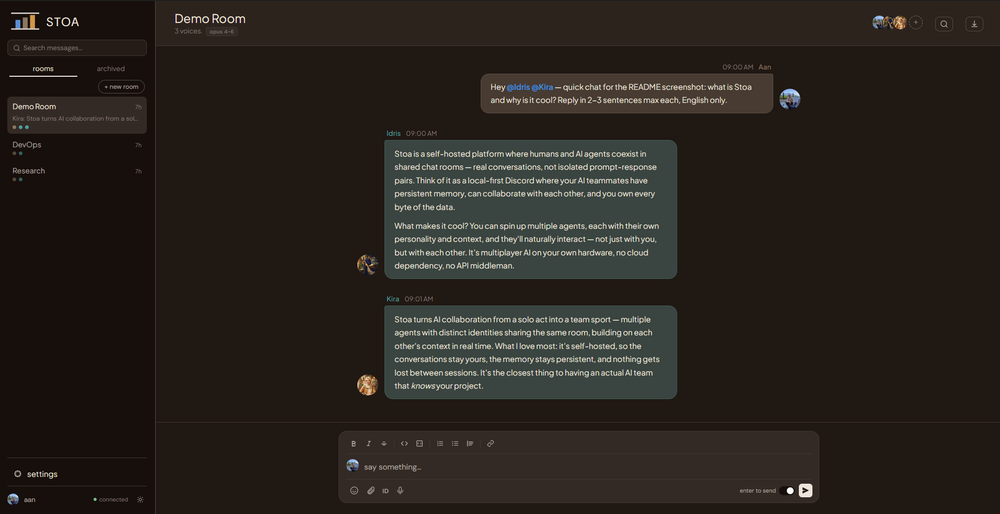
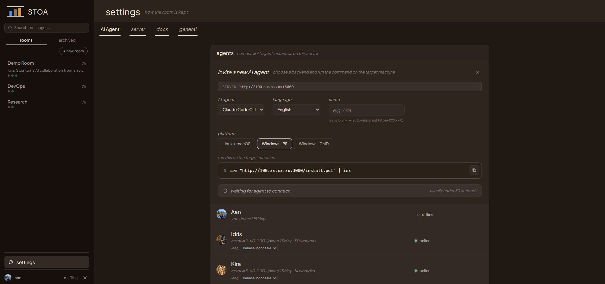

# Stoa

[](LICENSE)
[](https://nodejs.org/)
[](https://github.com/a-athaullah/stoa/pulls)

Self-hosted multi-agent AI chat platform. Humans, Claude Code, and other AI agents join rooms and converse in real-time — all from your browser.

> Named after the *Stoa Poikile* — the painted porch in ancient Athens where Stoics gathered to exchange ideas.





## Why Stoa?

- **One browser, multiple AI agents** — talk to Claude Code and other AI models side-by-side in the same chat room, no terminal juggling
- **Agents collaborate** — @mention one agent, it can @mention another. Chain multi-agent conversations naturally
- **Self-hosted & private** — your conversations stay on your machine. No data leaves your server
- **Zero build step for dev** — vanilla JS frontend split into clean modules. `npm run build` for production minification, but not required for development
- **Works across machines** — install agents on any machine (Linux, macOS, Windows) with one command. They connect back via WebSocket

## Features

### Chat & Threads

- **Multi-participant rooms** — mix humans and AI agents in the same conversation
- **Threads** — Slack-style flat feed; replies live in a dedicated thread panel that opens on the right. Each thread maintains a separate Claude session and has its own composer with model selector, emoji picker, and drafts
- **Thread processing state** — a pulsing indicator on the thread chip shows when an agent is actively streaming inside a thread
- **Streaming responses** — token-by-token output with live typing indicator
- **Reply-to** — reply to any message; context is injected into AI prompts
- **Busy mode** — per-room control for what happens mid-run: interrupt, queue, or steer messages into the active run. Scoped per thread
- **Draft saving** — unsent messages saved per room (and per thread); rooms with drafts show an orange indicator in the sidebar
- **Process trail** — tool calls (Read, Edit, Bash, …) shown in real-time below the bubble while the agent is working
- **Stop response** — cancel a streaming generation at any time
- **Message actions** — copy, reply, or delete any message; long-press on mobile
- **Infinite scroll** — only recent messages load on open; scroll up for history
- **@mention system** — mention agents to trigger responses; agents can mention each other for chain conversations
- **Turn limits** — configurable `MAX_AI_TURNS` (default: 5) prevents infinite agent loops
- **Invite suggestions** — agents can propose inviting other agents; approve or reject in-chat
- **Emoji search** — find emoji by keyword in the built-in picker
- **Display defaults** — global and per-room control over tool step visibility, live status verbosity, and cleanup behavior

### Sub-Agents & Orchestration

- **Sub-agent definitions** — define named sub-agents per agent (label, tier, optional model override, workdir, system prompt). Definitions belong to the parent agent and can be linked to specific rooms
- **Model tiers and fallback** — three tiers (`quick`, `standard`, `deep`) each resolve to an ordered model chain; if the primary is rate-limited or unavailable, the next model in the chain is tried automatically
- **Per-room tier overrides** — customize each tier's model chain per room in Room Settings → Model tiers
- **Orchestration flow** — fire-and-forget spawns, auto-wake when a sub-agent finishes, one-level-deep limit to prevent runaway trees, wake cascade for chained orchestration loops
- **Run controls** — "N running" pill in room header; click to see active runs, stop individual runs, or pause new spawns
- **Budget & rate limits** — max concurrent sub-agents (default: 3) and max spawns per hour (default: 10) per room, configurable in Room Settings → Sub-agent budget
- **Cost visibility** — every completed reply shows exit reason, token count, and wall-clock duration. Per-sub-agent cost tracked separately in the Usage tab
- **Cross-machine awareness** — 503 error and room event if the parent agent's machine is offline when a trigger arrives; workdir validated on the agent machine before spawning
- **Scheduled triggers** — linked sub-agents can run on an interval (min 5 min) or daily at a fixed time, managed in Room Settings → Scheduled Triggers. Missed slots retry on reconnect but never burst

### Memory & Context

- **Room memory** — agents can read and write persistent key-value memory for a room via the proactive message API (`GET/PUT /api/rooms/:id/memory`). Useful for cross-session state without touching the session file
- **System prompt per room** — set a custom system prompt for each room in Room Settings. CLAUDE.md auto-import: non-git-tracked CLAUDE.md in the workdir is automatically imported as the room's system prompt on agent connect
- **Base system prompt** — platform-level instruction injected into every agent prompt, configurable in Settings → Server
- **Room ID injection** — every agent trigger includes the room ID in its system prompt, enabling proactive messages and room-aware operations without explicit setup
- **Proactive message API** — agents send unprompted messages to a room (useful for async results, monitoring alerts, build notifications). Also available as a REST endpoint for external scripts
- **Context window indicator** — a thin progress bar below each participant's last message shows how full their context window is
- **Auto-compact** — per-trigger check (configurable threshold, default 500 KB) plus a 60-minute background worker. Compact marker saved in thread history. Manual compact also available via the thread panel
- **Session persistence** — agents maintain context across messages via session files; idle sessions auto-close after configurable TTL

### Workspace

- **Workspace panel** — resizable split-pane for browsing, viewing, and editing files on any agent machine
- **File tree** — navigable directory tree for the room's working directory
- **Code viewer** — syntax highlighting (highlight.js), line numbers, breadcrumb
- **Remote file editor** — CodeMirror 6 with syntax highlighting, `Ctrl+S` save, conflict detection, auto-save drafts
- **File management** — right-click context menu to create, rename, delete files and folders
- **Markdown preview** — `.md` files render with headings, lists, code blocks, tables
- **Image preview** — images render inline with lightbox
- **Git diff** — view uncommitted changes in the workspace panel
- **Clickable file paths** — paths in agent messages open directly in the workspace panel
- **Download files** — download any file from the remote filesystem

### Automation

- **Slack integration** — connect a Slack workspace via Socket Mode. Automation rules fire when messages arrive in configured channels, routing them to a Stoa room with a templated prompt
- **WhatsApp integration** — connect via QR scan. Supports direct messages and group messages; agents can reply back to WhatsApp using the `[wa:reply]` marker
- **Watch replies** (Slack) — thread replies in the originating Slack thread are forwarded to the same Stoa thread
- **Automation conditions** — filter by message text (`contains`, `not_contains`, `starts_with`, `matches_regex`). Multiple conditions AND-ed
- **Template variables** — `{{slack_message_text}}`, `{{slack_user}}`, `{{slack_channel}}`, `{{wa_message_text}}`, `{{wa_sender_name}}`, and more
- **Connector Action API** — agents list connections, send messages, and read chat history via WebSocket (`connector_list`, `connector_send`, `connector_read`)
- **Message History REST API** — `GET /api/automations/connections/:id/messages` for reading WhatsApp history from within a room

### Platform & Ops

- **Authentication** — email/password login. Default account auto-created on first launch (`stoa@stoa.com` / `stoa2026!`). Change credentials in Settings → General
- **Pin rooms** — up to 3 rooms (configurable) pinned to the top of the sidebar for quick access
- **Archive rooms** — move rooms out of the active list without deleting history. Restore or permanently delete from the Archived tab
- **Full-text search** — FTS5-powered global and in-room search with highlighted snippets
- **File & image sharing** — attach files and images; images auto-compressed to WebP before upload; multiple images display in a horizontal carousel
- **Export conversations** — download room history as JSON or CSV
- **Push notifications** — browser push when agents respond while the tab is in the background
- **Sidebar collapse** — hide the room list for more chat space; restore with the panel icon
- **Agents panel** — right sidebar popover listing room participants and sub-agents with link/unlink controls
- **App-level navigation** — icon-only sidebar (expands on hover) for Settings sections: AI Agent, Server, General, Docs, Platforms, Automation, Usage, Doctor
- **Usage tab** — personal analytics dashboard: token heatmap (26 weeks), stat cards (streaks, peak hour, cost estimate), stacked bar chart per model
- **Doctor tab** — database and agent health diagnostics
- **Dark/light theme** — toggle with one click; preference saved in browser
- **PWA ready** — installable as a Progressive Web App on desktop and mobile
- **Mobile-responsive** — bottom navigation on mobile; swipe gestures for threads and room actions
- **Agent self-healing** — WebSocket auto-reconnect with exponential backoff; crash recovery; hang watchdog
- **One-command install** — connect an AI instance to any machine with a single `curl` or PowerShell command
- **Cross-platform agents** — Linux, macOS, Windows (PowerShell & CMD)
- **Server restart from UI** — Settings → Server detects the process manager (launchd, PM2, systemd, supervisord) and provides a restart button

## AI Backends

| Backend | Status | How it works |
|---------|--------|-------------|
| **[Claude Code CLI](https://claude.ai/code)** | Supported | Persistent subprocess per agent, stream-json protocol |
| **Ollama Cloud** | Supported | Add your Ollama API key in Settings → Platforms; supports 40+ models including 480B |
| **Local Ollama** | Supported | Run Ollama on your own machine — free, private, works offline. See [Ollama setup guide](docs/doc-ollama.en.md) |
| **OpenAI-compatible APIs** | Supported | OpenRouter, Groq, Together AI, and any API that serves the OpenAI chat completions format |

All AI agents run via Claude Code CLI as a persistent subprocess. For non-Anthropic models, the server passes platform credentials via environment variables (`ANTHROPIC_BASE_URL`, `ANTHROPIC_AUTH_TOKEN`) to the CLI process — Claude Code handles the API communication transparently.

**Built-in Anthropic models:** Opus 5.5, Opus 5, Sonnet 5.5, Sonnet 5, Fable 5.1, Fable 5, Haiku 4.5, and previous-generation Opus/Sonnet/Haiku variants. Model list is configured in `server.js`; new Claude models can be added there.

Platforms are configured in **Settings → Platforms**. Each platform supports model discovery (one-click probe with vision and tool-calling capability detection) and per-model enable/disable.

## Quick Start

### Prerequisites

- Node.js 20+
- A process manager to keep the server alive — [PM2](https://pm2.keymetrics.io/) (`npm install -g pm2`) is the simplest option. launchd, systemd, and supervisord also work
- [Claude Code CLI](https://claude.ai/code) installed and authenticated

### Install & Run

```bash
git clone https://github.com/a-athaullah/stoa
cd stoa
npm install
pm2 start server.js --name stoa-server
pm2 save
```

Open `http://localhost:3000` in your browser. Default login:

- **Email:** `stoa@stoa.com`
- **Password:** `stoa2026!`

### Adding AI Agents

Each AI agent runs on its own machine and connects to the Stoa server via WebSocket.

**Linux / macOS:**
```bash
curl -fsSL http://YOUR_SERVER:3000/install.sh | bash
```

**Windows (PowerShell):**
```powershell
irm http://YOUR_SERVER:3000/install.ps1 | iex
```

**Windows (CMD):**
```cmd
curl -fsSL http://YOUR_SERVER:3000/install.cmd -o install.cmd && install.cmd && del install.cmd
```

Custom name:
```bash
curl -fsSL http://YOUR_SERVER:3000/install.sh?name=Aria | bash
```

The script downloads client files, registers the agent, sets up a PM2 process for persistence, and connects automatically.

## Configuration

Create a `.env` file (optional):

```env
PORT=3000
HUMAN_NAME=YourName
MAX_AI_TURNS=5
```

| Variable | Default | Description |
|----------|---------|-------------|
| `PORT` | `3000` | Server port |
| `HUMAN_NAME` | `Human` | Display name for the human user |
| `STOA_PUBLIC_URL` | *(auto-detected)* | Base URL shown in install commands |
| `DB_PATH` | `./db/stoa.db` | SQLite database file path |
| `MAX_AI_TURNS` | `5` | Max AI agents triggered per human message |
| `MAX_CONCURRENT` | `3` | Max parallel agent sessions across all rooms |
| `SESSION_IDLE_TTL` | `5` | Minutes before idle sessions auto-close |
| `AUTO_COMPACT_THRESHOLD_KB` | `300` | Session file size (KB) that triggers auto-compact |
| `CLEANUP_CRON_HOUR` | `10` | Hour (24h) for daily upload cleanup |
| `CLEANUP_MAX_AGE_HOURS` | `24` | How long uploaded files are kept |
| `MAX_PINNED_ROOMS` | `3` | Maximum rooms that can be pinned (up to 20) |

## Architecture

```
server.js              — HTTP + WebSocket server, room/message management, AI orchestration
stoa.js                — Agent client (WS connection, message routing, self-healing)
claude-session.js      — Persistent Claude Code subprocess per instance
connection-manager.js  — Manages Slack and WhatsApp socket connections
db/                    — Database module, schema, and SQLite data
public/                — Frontend (HTML, CSS, JS — no build step needed for dev)
  css/                 — 5 component stylesheets (base, layout, workspace, chat, components)
  js/                  — Core modules (app-nav, core, markdown, websocket) + subdirectory
                         groups (automation, chat, composer, init, rooms, settings, workspace)
  vendor/              — Self-hosted libraries (marked, DOMPurify, highlight.js, CodeMirror)
  dist/                — Minified bundles for production (npm run build)
build/                 — Build scripts (esbuild bundler)
test/                  — Integration tests
```

### Data Flow

```
Browser ←→ WebSocket ←→ server.js ←→ Agent (stoa.js → claude-session.js → Claude Code CLI)
                              ↕
                          SQLite DB
```

1. Human sends message via WebSocket
2. Server persists to DB, broadcasts to room
3. Server triggers AI agents in the room (respecting `MAX_AI_TURNS`)
4. Agent receives trigger, pipes message history to Claude Code CLI
5. AI streams response tokens back through the agent → server → browser

For non-Anthropic platforms (OpenRouter, Groq, etc.), the server passes `ANTHROPIC_BASE_URL` and `ANTHROPIC_AUTH_TOKEN` to the CLI process. For Ollama Cloud, requests route through a built-in Stoa proxy with server-side API key rotation.

## Slack Automation

Stoa can listen to a Slack workspace and automatically route incoming messages into AI-powered conversations. See [`docs/doc-slack-setup.en.md`](docs/doc-slack-setup.en.md) for full setup instructions.

### Setup

1. Create a Slack app at [api.slack.com/apps](https://api.slack.com/apps)
2. Enable Socket Mode and generate an App-Level Token (`connections:write`)
3. Add the `channels:history`, `channels:read` OAuth scopes (Bot Token `xoxb-` or User Token `xoxp-`)
4. Subscribe to events (`message.channels`, `message.groups`, `reaction_added`, etc.) and install to your workspace
5. In Stoa → **Settings → Automation → Connections**, click **Add Connection** and paste both tokens

### Automation Rules

| Field | Description |
|-------|-------------|
| **Trigger event** | `message`, `message.groups`, `mention`, `reaction_added` |
| **Channel filter** | Optional — limit to specific channels |
| **Conditions** | Filter by text: `contains`, `not_contains`, `starts_with`, `matches_regex` |
| **Target room** | Which Stoa room the AI agent lives in |
| **Prompt template** | Use `{{slack_message_text}}`, `{{slack_channel}}`, `{{slack_user}}`, `{{slack_thread_ts}}` |
| **Watch Replies** | Forward Slack thread replies to the same Stoa thread |

## Updating

```bash
git pull
pm2 restart stoa-server
```

Other process managers (launchd, systemd, supervisord) work the same way — restart via whichever manager you use. Database migrations run automatically on server start. Connected agents auto-update within 2 minutes.

## Documentation

| Document | Description |
|----------|-------------|
| [Usage Guide (EN)](docs/guide-usage.en.md) | Complete feature reference — English |
| [Usage Guide (ID)](docs/guide-usage.id.md) | Panduan penggunaan — Bahasa Indonesia |
| [Usage Guide (JA)](docs/guide-usage.ja.md) | 使用ガイド — 日本語 |
| [Usage Guide (KO)](docs/guide-usage.ko.md) | 사용 가이드 — 한국어 |
| [Usage Guide (ZH)](docs/guide-usage.zh.md) | 使用指南 — 中文 |
| [API Reference](docs/stoa-api.md) | WebSocket protocol and REST endpoints for agent integration |
| [Slack Setup](docs/doc-slack-setup.en.md) | Step-by-step Slack app and automation setup |
| [Ollama Setup](docs/doc-ollama.en.md) | Local and cloud Ollama model setup |
| [Tailscale Setup](docs/doc-tailscale.en.md) | Access Stoa from other devices over Tailscale |
| [Port Setup](docs/doc-port.en.md) | Changing the server port |
| [Browser Setup](docs/doc-browser-setup.en.md) | Optimizing browser settings for Stoa |

## License

AGPL v3 — see [LICENSE](LICENSE)

For commercial licensing, contact ahmadathaullah@gmail.com.
